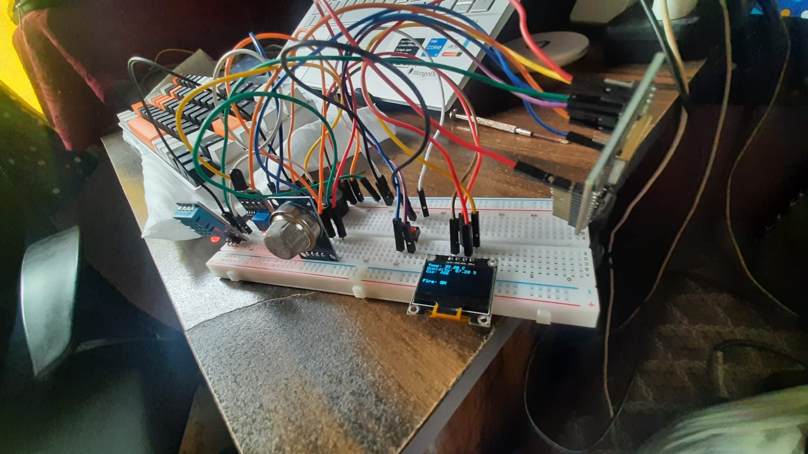
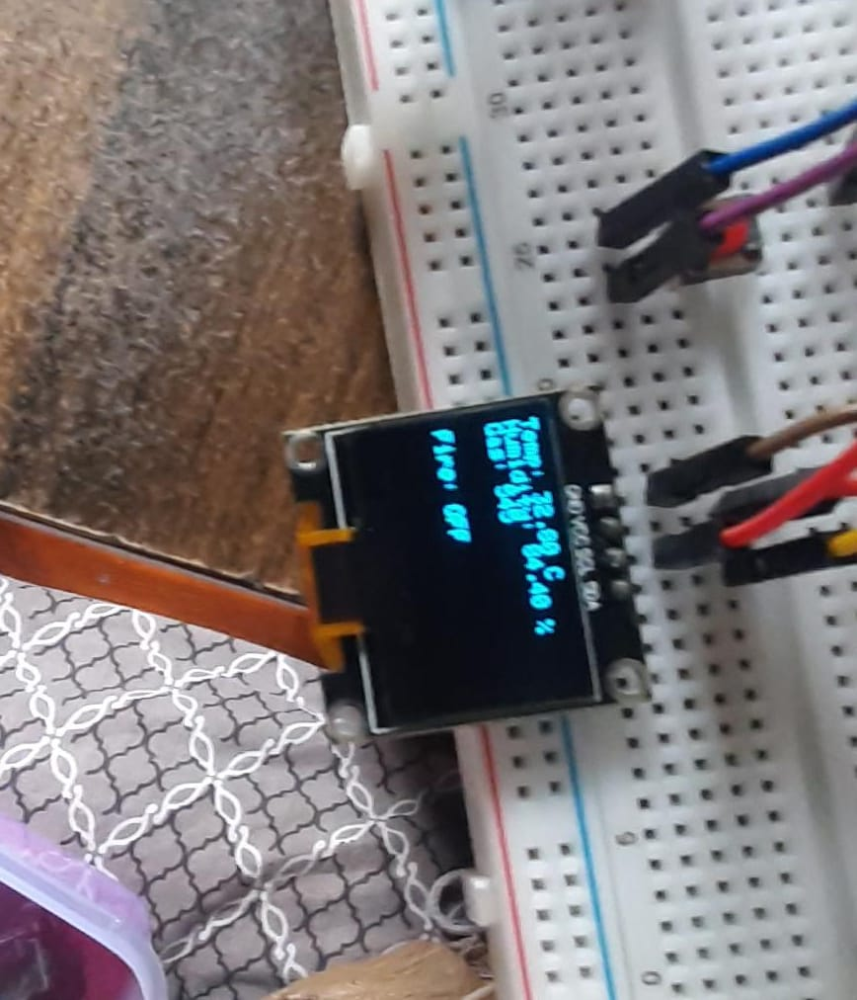
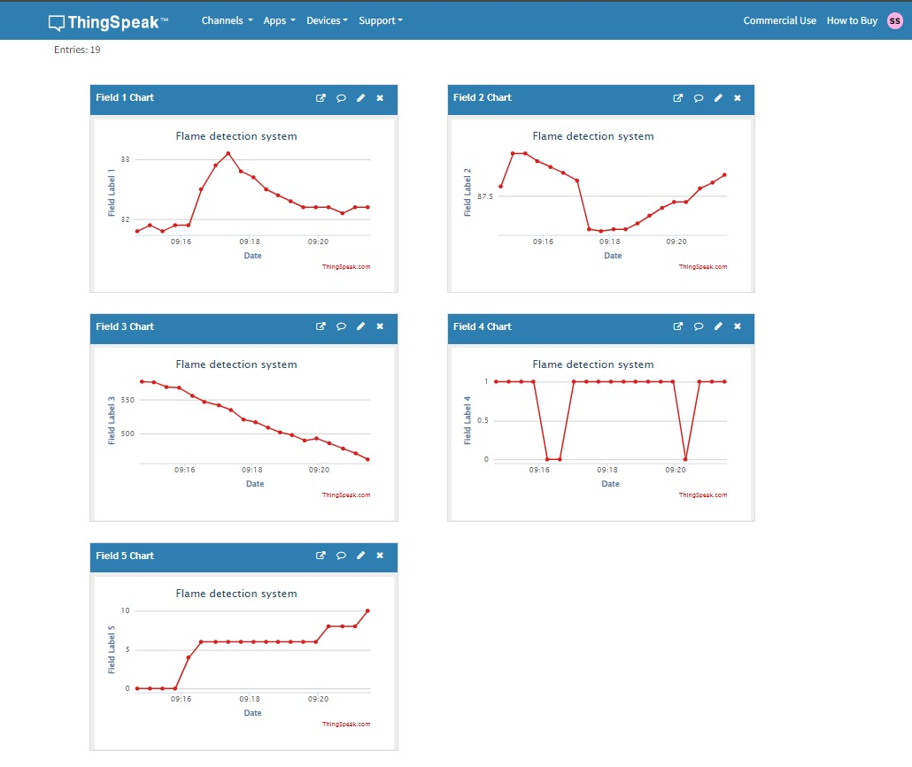
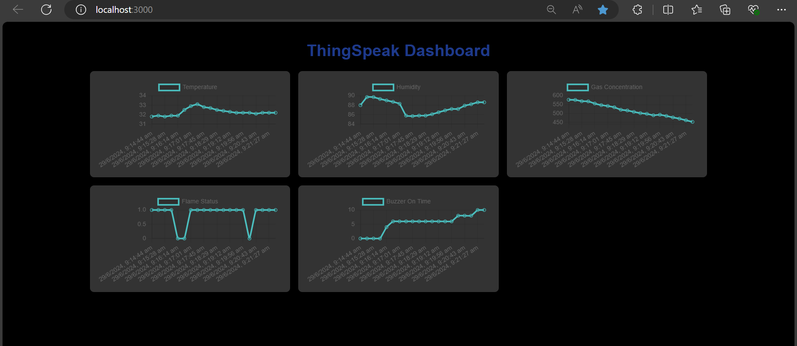
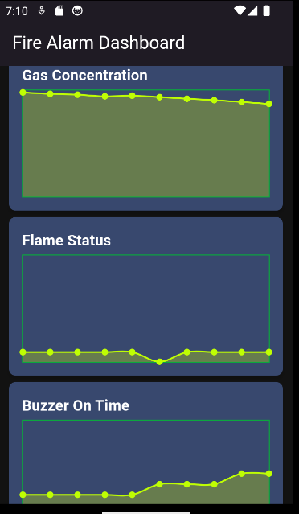

# Fire Detection System & Storing Sensor Data on Thinkspeak & Showing in NextJS & Flutter Dashboard


### Here by Using NodeMCUESP8266 & DHT11 Tempearature & Humidity based Sensor,MQT12 Gas Sensor,Flame IR sensor,Buzzer &  Cloud Service Like ThinkSpeak we can Read the Tempearture,Humidity,Gas Conectrataion & Flame Collected by the Sensors & show it in the ThinkSpeak Console & an Web Dashboard Using NextJS.

## Working Circuit :



## OLED Screen Display  :


## Think Speak Console :

<B> After 17 Reading
<B> Field 1 is Temperature 
<B> Field 2 is Humidity 
<B> Field 3 is Gas Concentrtation
<B> Field 4 is Flame Status
<B> Field 5 is Buzzer on Time



## Web Dashboard:-


<B> Created an Web dashboard using Nextjs to showcase the data in realtime from Thinkspeak,the data is being fetched from the Thinkspeak Server using READAPI of the Thinkspeak 

## App Dashboard:-


<B> Created an App dashboard using Flutter  to showcase the data in realtime from Thinkspeak,the data is being fetched from the Thinkspeak Server using READAPI of the Thinkspeak 


## Explantation:-

### As we can see that there are total 5 filed with 19 entries in total & 3 of them are when the flame is detected,so when we see the data collected when the flame is on or off we observe that there is a differnece in the reading such for instance we observe that temperature (Field 1) is increasing when the flame is on & remains low or normal when not dtectyed then when we observe that humidty (Field 2) is decreasing because as the moisture of the air around the flame is decreasing due to the heat of the flame the buzzer is going on the gas concentration (Field 3) is decreasing as the wax burning  
from the flame does not warrant an gas concentrataion(like methyl & propane or other kind of flammable gas) instead  it reduces the oxygen & nitrogen  conecntrtation around the flame, similarly we see that in flame status that when detected it remains low otherwise it remain high. We trigger the Alarm only when the flame is detected or the Gas Concentrtaion is above 1000 people may change their trigger opertation as they see fit. On the OLED Screen we are displaying the weather the Fire is on or off the Temp in Celsuis, Humidity & Gas Concentrtation.

## Working Video:-
https://www.youtube.com/shorts/Jp69f5ARkDY


## Running the Application on Web 

To run the Next.js application, follow these steps:

1. Navigate to the  directory:
   ```sh
   cd web
   cd my-thinkspeak-dashboard
   npm run dev

2. Can  Run on Docker also
```bash
docker pull shinjan02/fire:dev
```


## Running the Application on Flutter 

To run the Flutter application, follow these steps:

1. Navigate to the  directory:
   ```sh
   cd App
   cd appfire
   flutter run


## Components Required :

<ul>
<li>NodeMCU ESP8266</li>
<li>DHT11</li>
<li>Wire (Male-Male,Male-Female)</li>
<li>Power Supply(From Comp/9v Battery)</li>
<li>Thinkspeak Account</li>
<li>MQT2(Gas Sensor 4 Port preferably as it has both analog & digital)</li>
<li>Flame IR Sensor(it produces low value when flame is detected otherwise remain high)</li>
<li>Buzzer</li>
<li>Button(to turn on or off the system)</li>
<li>Candle for Tesing(aslo lighter will work)</li>
<li>Screwdriver (For adjusting the flame ir sensor senstivity it differs from another to another, clockwise for senstivity increase & anti-clockwise for  senstivity decrease)</li>
<li>Node Installed for Working in the NextJS Applictation</li>
<li>Flutter & Android Studio </li>
<li> USB Cabel </li>
</ul>
